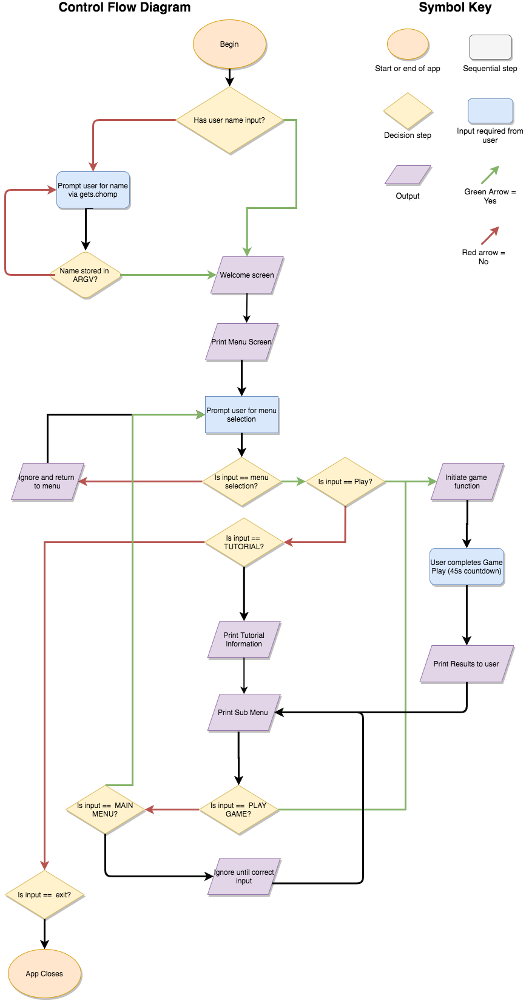

# **T1A3 Assignment - Terminal Application** 
### **by Annabelle Caspersz**
<br>

### **R3: Referenced Sources**
  
ASCII ART GENERATOR: <https://asciiart.club/>

<br>

### **R4: Provide a link to your source control repository**

Remote repository (GitHub): <https://github.com/ACaspersz/fishbrains>

<br>

### **R5: Software Development Plan: Statement of Purpose and Scope**

*FishBrains* is a memory based flash card game that will test the users information processing ability by matching symbols quickly and accurately.  

**What problem will this application solve?**  
The ability to rapidly identify, process and act on short term patterns is a cognitive ability that is essential for both adults and children today, in the workplace, home and at school. Processing speed is associated with reading and math ability, and so is strongly correlated with reading and math achievement in children. However, informational processing can be impaired in some people, such as cases of executive function disorder (for example, ADHD) and learning disabilities. Additionally, poorer processing speed is common in people as they age, and is a key indicator of cognitive decline or frailty.

Simple brain training exercises have been shown to improve information processing and general cognitive ability. Therefore, a simple speed memory game is ideal not only so the user can assess their baseline ability, but also so they can work on this skill and improve this essential function with continued use. 

 **Who is the target audience?**  
This game is for anyone who wants to improve their information processing ability, whether they are children, adults or elderly. Because of the simple interface the game is useful and understandable to all ages, as the symbols and input requirements are easy to grasp.

**How will the target audience access the application?**  
The user will only require access to a Mac computer. Once the game is downloaded along with its associated gems, it can be run anytime from the command line. It can be accessed anytime the target audience would like to test their ability, compare with their previous stats or other users stats, or hit a personal best score. Its simple functionality and navigation make it understandable and playable by all.

### **R6: Features of the application**

**1. User can input their name from the command line**.  
 After beginning the app, the user will be prompted to enter their name, which will be stored and used throught the application to personalise experience.

**2. Main Menu: Play game, Tutorials, Highscores, Exit**.  
 Includes the following:
 - *Play Game*, which initiates a round of the flash card game. 
 - *Tutorial*, which explains the rules of the game and how to play, including how the scores are calculated.
 - *Highscores*, which allows user to view highscores from previous game play.
 - *Exit*, to exit the application when finished. 

**3. Play Game**   
- If selected from the main menu, game will be initiated. Player will be shown one of four symbols on screen which they will need to match to the previous shown symbol, in order to increase their score, until 45 seconds has passed. 
- Will be given a 45 second countdown which will be visualised on screen as the game progresses. 
- After 45 seconds, the game ends and the score will be given to user.  
- User can then choose to play again or to return to the main menu.

**4. Tutorial Screen**  
If Tutorial is selected from the main menu, the player will be shown instructions on how to play the game, as well as how the score is calculated.

<!-- **4. High Scores**: If selected from the main menu, the High Scores function will display a TTY table of the top 5 scores recorded in previous game play.  -->

**5. Sub-Options Menu**  
At the end of either the 'Play Game', 'High Scores' or 'Tutorial' screens, a sub-options menu will be shown with one of two options: 'Play again' or 'Return to main menu' which allows navigation to either of these options, and menus to be accessible from anywhere. 


### **R7: User interaction and experience**

**How the user will find out how to interact with / use each feature?**   
- Upon launching the game, the user's name will be captured. 
- The user will be initiated into the game by the welcome screen which will transition into the main menu, which uses up down keys for movement through selections and enter to select. The selection will be highlighted when it is been hovered over to assist the player to navigate the menu. 
- Each screen that the user navigates to will have text that instructs them of the purpose of the page.
-Each screen has a sub-options menu that allows navigation back to other pages which are clearly indicated. 

**How will the user interact with / use each feature?**  


*User input*   
 After beginning the app, the user will be prompted to enter their name, which will be stored and used throught the application to personalise experience. Once a name is correctly obtained, the user proceed through a short welcome screen to the main menu automatically.

*Main Menu*  
 Underneath the banner the user is given the following options, with highlighted text (press up/down arrows to move, enter to select)  
    - *Play Game*   
    - *Tutorials*  
    - *Highscores*  
    - *Exit*  

*Play Game*  
If selected from the main menu, game will be initiated. Player will be shown a single symbol (one of 4 possible options, randomly drawn) on screen while the game provides a countdown to start, to give the player time to adjust to game play. 

When countdown finishes, one of 4 symbols will be randomly generated, and the player must respond indicating whether the symbol matches the previous symbol, while a timer appears on screen during play, which indicates to player how much time they have remaining, and to add a further stressor to game play. Players aim to correctly match all symbols in order to increase their score, until 45 seconds has passed. 

After 45 seconds, the game ends and the score will be given to user on screen. 

User can then choose to play again or to return to the main menu.

*Tutorial Screen*   
If Tutorial is selected from the main menu, the player will be shown instructions on how to play the game, as well as how the score is calculated. Player will then be shown a sub-menu that returns them either to game play, or to the main menu. 

<!-- - High Scores: 
If selected from the main menu, the High Scores function will display a TTY table of the top 5 scores recorded in previous game play.  -->

*Sub-Options Menu*    
At the end of either the 'Play Game', 'High Scores' or 'Tutorial' screens, a sub-options menu will be shown with one of two options: 'Play again' or 'Return to main menu' which allows navigation to either of these options, and menus to be accessible from anywhere.

<br>
<br>

**How will errors be handled by the application and displayed to the user?**  
<br>
The application utilizes conditional loops to consider situations where an input from user is invalid for the application. In most cases in this application, if the user enters an input that is invalid, the error will be ignored if it is not an option in any menu screen. 

If user does not enter a user name, they will see an error statement saying "User name required!" and will not be able to continue until a name is entered. 

If an invalid entry is entered during gameplay, user will be able to retry the same symbol and enter a valid input, and continue to attempt this until the countdown finishes. Because of the game play loop structure, their response time will be affected by invalid entries, so the user is more motivated to input correctly. 


### **R8: Control FLow**
<br>



### **R9: Implementation Plan**

Trello board: <https://trello.com/b/enQ4AeJ1/terminal-application-project>

I used Trello to manage implementation requirements for this project, which can be accessed at the above link. 

<br>

### **R10: Help Documentation**

### **System Requirements**
FishBrains utilizes gems that are Mac dependent and has not been tested on any other operating systems.

FishBrains has only been tested on Mac OS High Sierra version 10.13.6.

### **Dependencies**

The following Ruby Gems are required to run this application: 

- gem "rspec", v 3.9
- gem "tty-prompt" v0.22.0
- gem 'colorize', v0.8.1
- gem 'artii', v2.12


### **How to Install and Run this application**

If you do not have Ruby installed on your computer, follow these instructions to [install and run](https://www.ruby-lang.org/en/documentation/installation/).

Once this is completed, download source documentation at <https://github.com/ACaspersz/fishbrains>

On the terminal command line, navigate to the directory you just cloned.

If you do not have the 'bundler' gem installed on your computer, please enter the following code.
```
$ install bundler
```
Once 'bundler' has been installed, enter the following code to install the gems required for the application.
```
$ bundle install 
```
When you have navigated to the `src` folder, run the application by inputting the following command 

```
$ ruby controller.rb
```

You also have the option to enter your name as argument from the command line for use within the app.
```
$ ruby controller.rb name
```
<br>

### **OR**  

<br>

 Alternatively, you can run the application with the bash script supplied in the source code. Navigate to the `controllers` folder in your bash terminal and enter the following to run the program: 

 ```
 ./run_app.sh
 ```
